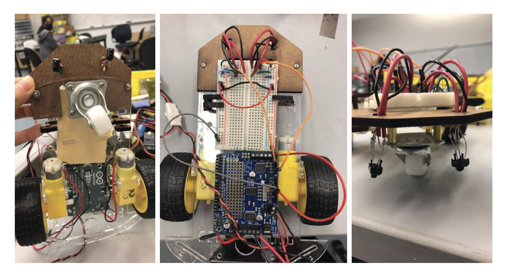
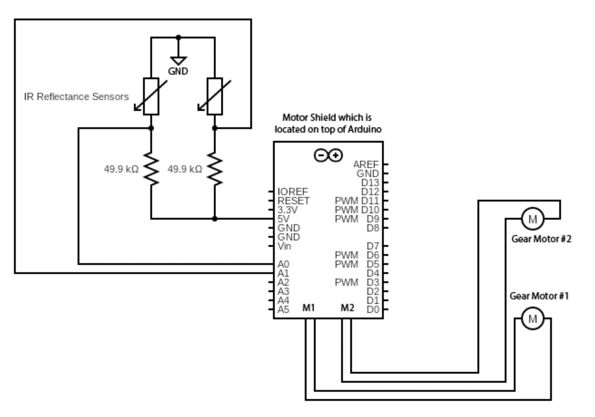

# Willy the Line Follower

## About
A line-following robot using arduino motorshield and two infrared reflectance sensors.

## Table of Contents
>   * [About](#about)
>   * [Table of contents](#table-of-contents)
>   * [Installation](#installation)
>   * [Starting the Robot](#starting-the-robot)
>   * [Mechanical Parts of the Robot](#mechanical-parts-of-the-robot)
>   * [Circuit Diagram](#Circuit Diagram)


## Installation

1. Clone the repo to a file
```bash
git clone https://github.com/MariKang/line-following-robot.git
```

2. Install the python libraries using pip install

The libraries we use in this project include:

matplotlib
pandas
csv
seaborn
pyserial
time

Install the libraries that doesn't exist in your computer. For example,
 
```bash
pip3 install pandas
```

3. Install the Arduino libaries

Open Arduino and go to Tools -> Manage Libaries... to download the libaries for motorshield. 


## Starting the Robot

Compile and run linefollowing.ino


## Mechanical Parts of the Robot



Above is the final assembly of the model. The two IR sensors are facing the floor, keeping small distance from the surface to detect the black line. The CAD files are in the CAD folder. 

## Circuit Diagram

